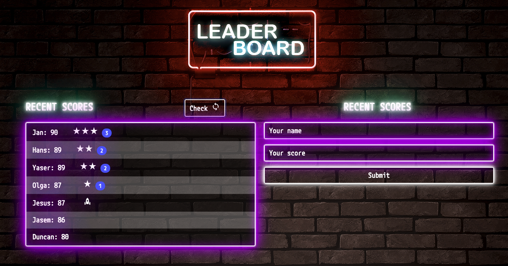

# Leaderboard

> This is an app where you can check and submits scores usings APIs.

Additional description about the project and its features.

## Built With

- HTML
- CSS
- JS
- Webpack
- Async/Await
- APIs
- Babel

## Getting Started

To get a local copy up and running follow these simple example steps.

### Setup

- Clone it as `git@github.com:JasemDuncan/Leaderboard.git`
- Run: npm install
- Run: npm run build
- Run: npm run start

## Authors

👤 **Jasem Valencia**

- GitHub: [@JasemValencia](https://github.com/JasemDuncan)
- Twitter: [@JasemValencia](https://twitter.com/JasemValencia)
- LinkedIn: [@JasemValencia](https://www.linkedin.com/in/jasem-duncan-valencia/)

## 🤝 Contributing

Contributions, issues, and feature requests are welcome!

Feel free to check the [issues page](../../issues/).

## Show your support

Give a ⭐️ if you like this project!

## Acknowledgments

- Hat tip to anyone whose code was used
- Inspiration
- etc

## 📝 License

This project is [MIT](./MIT.md) licensed.
